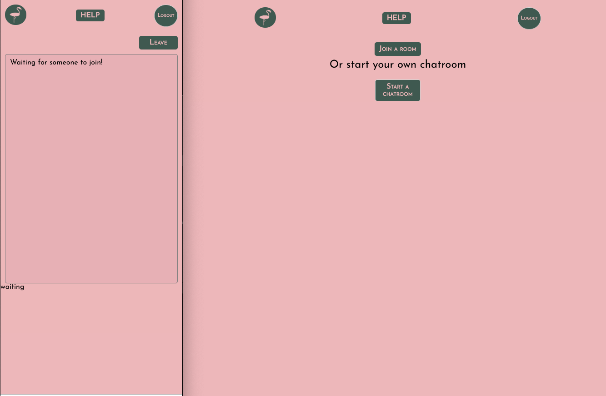
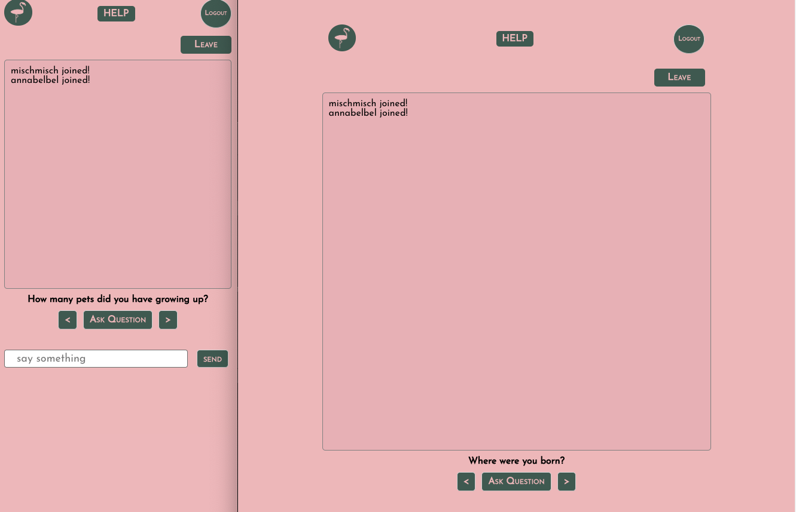
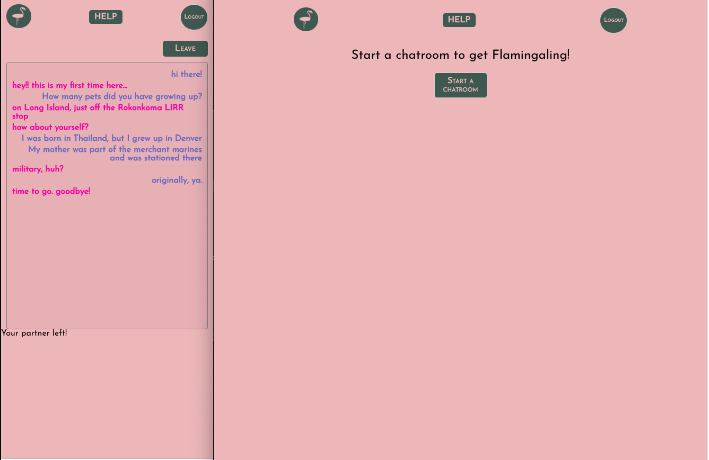
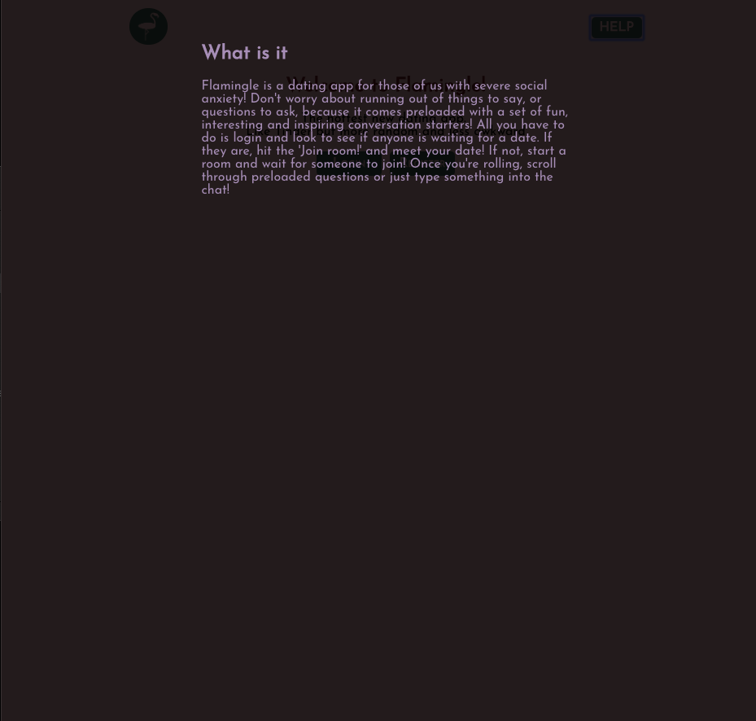

## Flamingle

Flamingle is a dating app for those of us with severe social anxiety! Don't worry about running out of things to say, or questions to ask, because it comes preloaded with a set of fun, interesting and inspiring conversation starters! All you have to do is login and look to see if anyone is waiting for a date. If they are, hit the 'Join room!' and meet your date! If not, start a room and wait for someone to join! Once you're rolling, scroll through preloaded questions or just type something into the chat!

### **`Contents`**

- [Tech stack](#tech-stack)
- [Links](#links)
- [Navigating repos](#navigating-repos)
- [Screenshots](#screenshots)

### **`Tech stack`**

#### Front End

- React
- Redux
- Socket.io

#### Back End

- Express
- Mongodb and Mongoose
- Socket.io

### **`LINKS`**

[Live App](https://https://flamingle.netlify.com/)

**Github repos here:**

front-end: https://github.com/thinkful-ei25/chat-dating-app-mischa

back-end:
https://github.com/thinkful-ei25/chat-date-server-mischa

### **`Navigating repos`**

**Front-end**

Root-component: src/chat-components/chat-date.js  
Chat room: src/chat-components/chatArea.js  
Chat room actions in: src/actions/chat-room.js  
Messaging actions in : src/actions/chat.js/  
Auth components are all in src/auth-components

**Back-end**

_Routes are defined in in files ending with xxxRouter.js  _

Routing in /server.js express's app.use()

Registration routes: /auth/authRouter.js  
Login routes: /users/userRouter.js  
Chatroom routes: /chatroom/chatRoomRouter.js  
Messages routes: /messages/messagesRouter.js  

Data is accessed with models created with Mongoose schemas  

User model: /users/userModel.js  
Chatroom model: /chatroom/chatRoomModel.js
Messages model: /messages/messagesModel.js

### **`Screenshots`**

 
 

